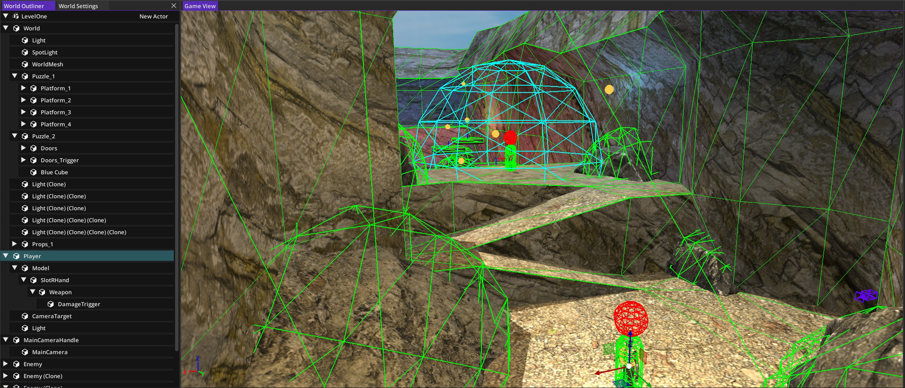
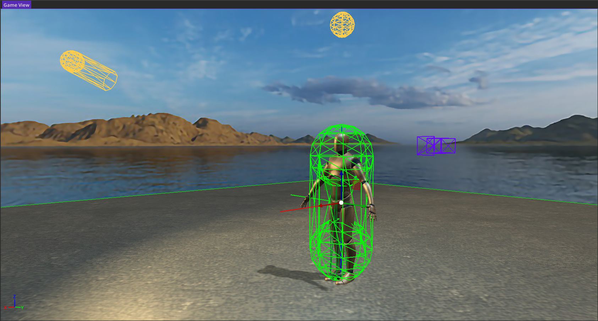

# ArgEngine



## Introduction

<b>ArgEngine</b> is a complex 3D game engine including an editor application that lets users
create three-dimensional games by composing <i>Actors</i> and their <i>Components</i> inside 
a <i>Game World</i>.
Engine contains a set of built-in components, but the list can be extended through 
scripting components in <i>Lua</i> language.
An <i>example project</i> is included for users to explore.

## Features



* 3D rendering system
  * Dynamic lighting and shadows
  * Skeletal animations
* Lua scripting
* Physisc capabilities
* 3D audio
* Input management
* Editor application
* Resource management system
* Multiple projects support

## Example project


Example project contained inside <b>ExampleProject</b> directory shows how the engine can be 
used to create a simple 3D action game including combat, platforming and puzzle elements.

To create a new scripted component, a template can be used:
```lua
DEF_COMPONENT('ComponentName')

DEF_FIELD('ComponentName', 'fNumber', 1.0)
DEF_FIELD('ComponentName', "aActorReference", Actor.new())

-- Engine callbacks

function ComponentName:_OnCreate()
    -- Constructor
    -- Code here...
end

function ComponentName:_OnDestroy()
    -- Destrukcor
    -- Code here...
end

function ComponentName:_BeginPlay()
    -- Game starts
    -- Code here...
end

function ComponentName:_Tick(time, input)
    -- Main loop update feedback
    -- (time) - game time
    -- (input) - input devices
    -- Code here...
end

function ComponentName:_OnDrawDebug(context)
    -- Debug drawing
    -- (context) - drawing context
    -- Code here
end
```

## Technologies

* [glfw](https://www.glfw.org/)
* [glad](https://glad.dav1d.de/)
* [glm](https://github.com/g-truc/glm)
* [stb](https://github.com/nothings/stb)
* [assimp](https://assimp.org/)
* [yaml-cpp](https://github.com/jbeder/yaml-cpp)
* [sol2](https://github.com/ThePhD/sol2)
* [bullet3](https://github.com/bulletphysics/bullet3)
* [irrKlang](https://www.ambiera.com/irrklang/)
* [Dear ImGui](https://github.com/ocornut/imgui)

## Requirements

* [Visual Studio 2022](https://visualstudio.microsoft.com/pl/)

## Build

! At the moment building is only available for the <b>Windows</b> platform
1. Create <i>'../ArgBuild'</i> directory in desired location
2. Build <b>ArgEditor</b> project and put the executable inside <i>'../ArgBuild'</i> directory
3. Copy <i>'ArgEditor/Build'</i>, <i>'ArgEditor/Content'</i>, <i>'ArgEditor/UserConfig'</i> and <i>'ArgEditor/irrKlang.dll'</i> into <i>'../ArgBuild'</i> directory
4. Build <b>ArgRuntime</b> project and put the executable inside <i>'../ArgBuild/Build'</i> directory

To open the editor run <i>'../ArgBuild/ArgEditor.exe'</i>
